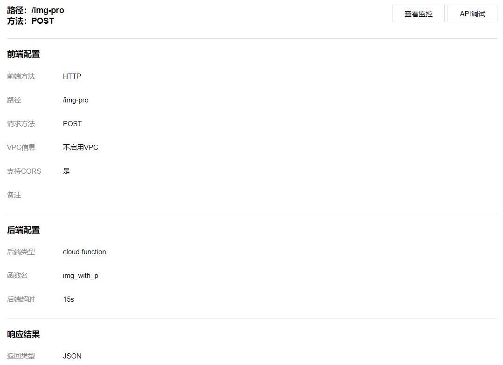

# API网关接入

## image_process



访问网址：
```
http://service-mayhx21s-1254095611.ap-guangzhou.apigateway.myqcloud.com/release/img-pro
```

源码: [source](./v3)

### 注意事项
* CORS为跨域访问：有2个地方需要配置：对象存储，API网关
* 在Body中的特殊字符会urlencode或者Unicode编码。

### 可用字体
* Lato-Regular.ttf
* cour.ttf
* msyh.ttc
* simsun.ttc
* times.ttf
