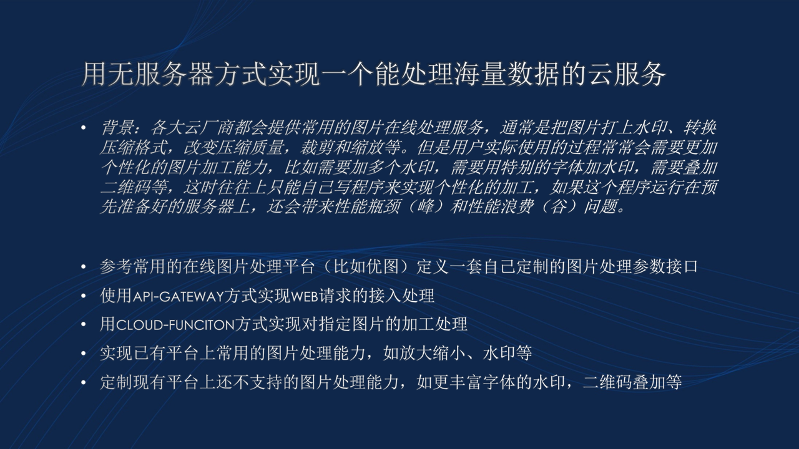

# FaaS Based Massive Data Processing Cloud Service 
CS304 Software Engineering Project

## TODOs
### TODO outlines
- [ ] ~~Golang picking up~~
- [ ] ~~Platform setup~~
- [ ] Front end construction
- [ ] API discussion
- [x] Regular meeting 1(19/3/2018, 9:00)
- [x] Regular meeting 2(26/3/2018, 9:00)
- [ ] Regular meeting 3(2/4/2018, 9:00)

### TODO this week (3.19)

- [ ] 二维码叠加 -- @nixizi
- [ ] 图片水印、文字水印 -- @Spacebody
- [x] 放大、缩小 -- @liziwl
- [ ] 圆角处理 -- @liziwl
- [ ] 前端页面 -- @zcy013 @yulianmiao

### TODO Image process
- [ ] 图片旋转
- [ ] 比例裁剪
- [ ] 图片大小压缩
- [ ] 画风迁移
- [ ] 图片无损放大

Tutor: [Stone](https://cloud.tencent.com/developer/user/561187/activities) 
## Reference Links
* [Golang](https://golang.org)
* [OpenFaaS](https://www.openfaas.com)
* [无服务器云函数 文档](https://cloud.tencent.com/document/product/583)
* [API网关 文档](https://cloud.tencent.com/document/product/628)
* [命令行工具 文档](https://cloud.tencent.com/document/product/440)
* [用 FaaS 实现比优图更灵活的大量图片快速加工能力](https://cloud.tencent.com/developer/article/1011234)
* [Pillow official doc](https://pillow.readthedocs.io/en/latest/) -- Python图片处理库
