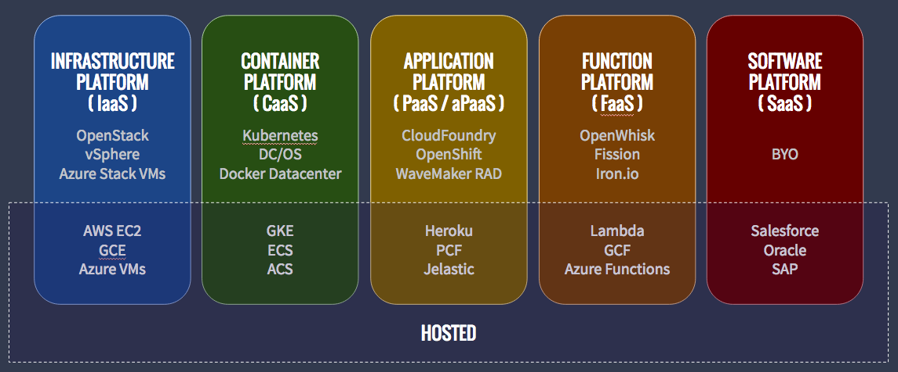
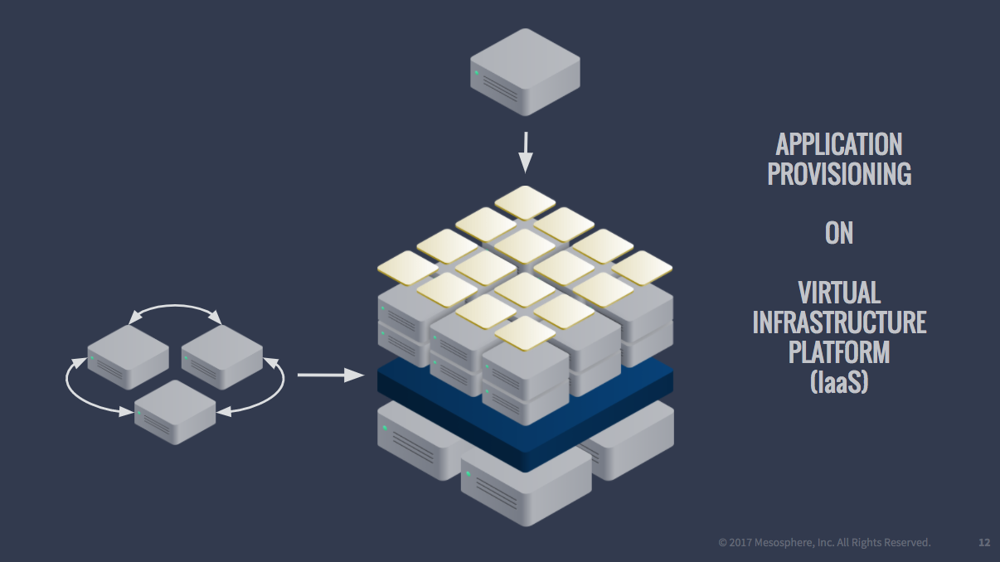
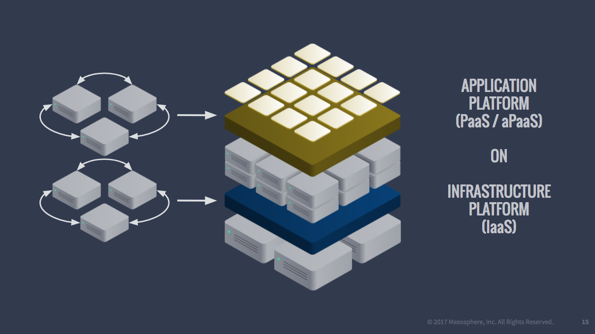
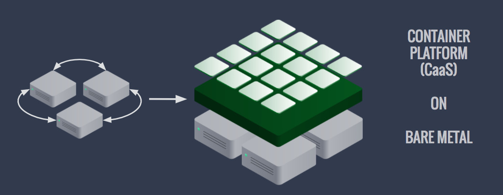
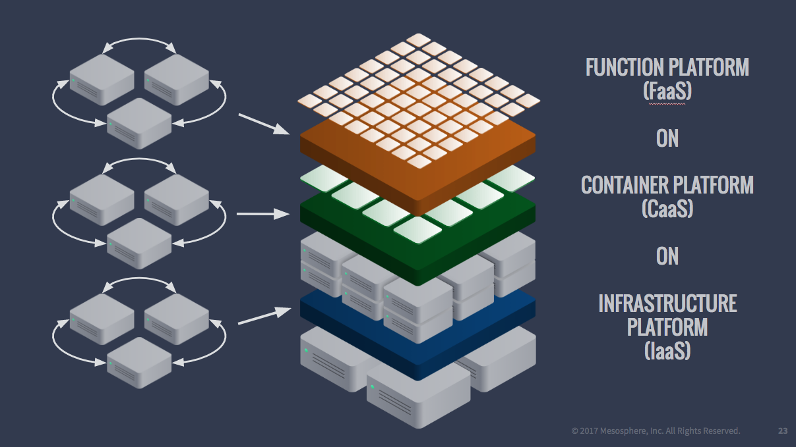
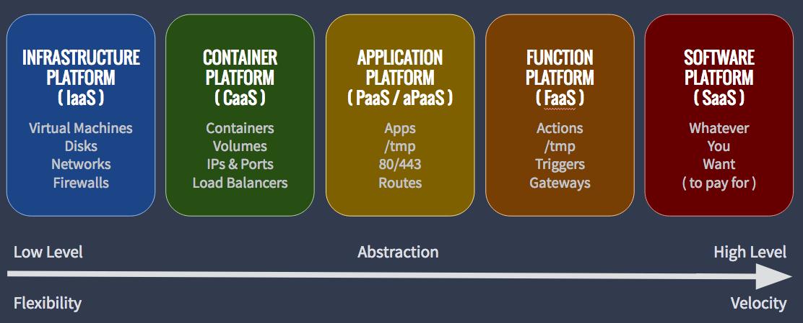
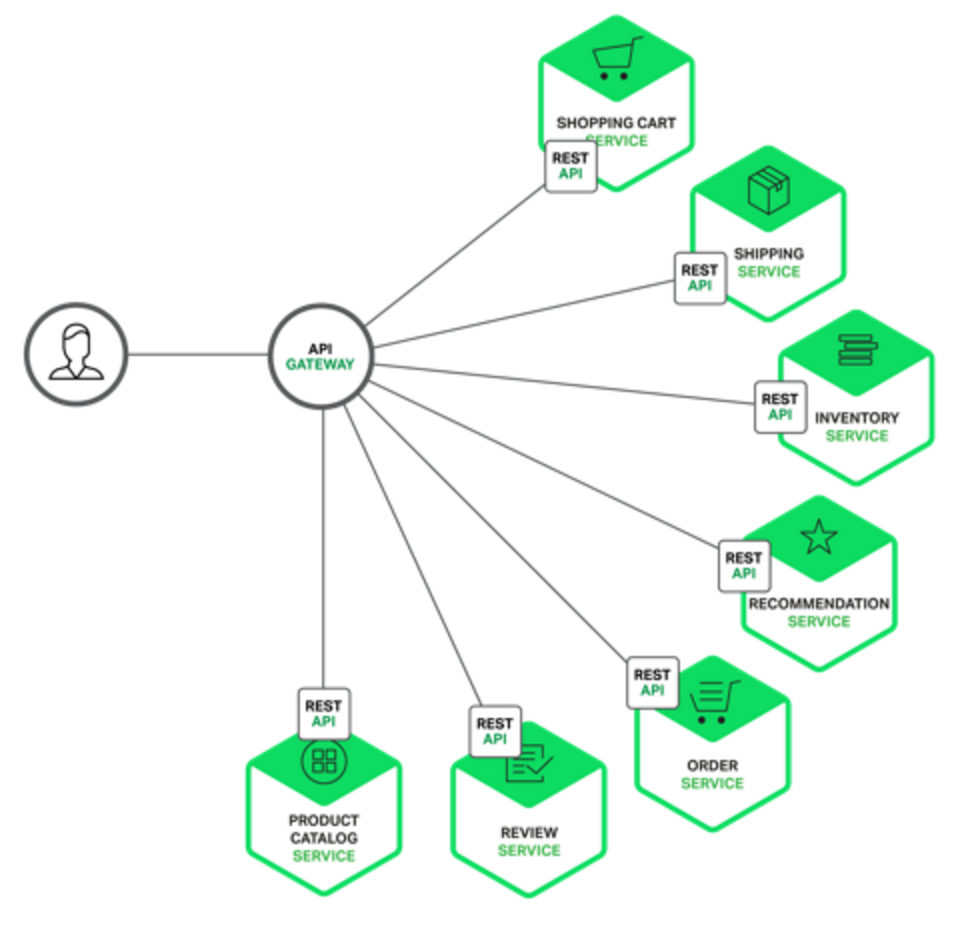

- What is FaaS

Function as a service (FaaS) is a category of cloud computing services that provides a platform allowing customers to develop, run, and manage application functionalities without the complexity of building and maintaining the infrastructure typically associated with developing and launching an app. Building an application following this model is one way of achieving a "serverless" architecture, and is typically used when building microservices applications.(Wiki)

- What is Serverless?

Serverless computing is a cloud computing execution model in which the cloud provider dynamically manages the allocation of machine resources. Pricing is based on the actual amount of resources consumed by an application, rather than on pre-purchased units of capacity. It is a form of utility computing.

Serverless computing still requires servers, hence it's a misnomer. The name "serverless computing" is used because the server management and capacity planning decisions are completely hidden from the developer or operator. Serverless code can be used in conjunction with code deployed in traditional styles, such as microservices. Alternatively, applications can be written to be purely serverless and use no provisioned servers at all.(Wiki)

- How FaaS developed?

FaaS is an extremely recent development in cloud computing, first made available to the world by hook.io in October 2014, followed by AWS Lambda, Google Cloud Functions, Microsoft Azure Functions, IBM/Apache's OpenWhisk (open source) in 2016 and Oracle Cloud Fn (open source) in 2017 which are available for public use. FaaS capabilities also exist in private platforms, as demonstrated by Uber's Schemaless triggers.(Wiki) Nowadays more domestic companies provides FaaS including Alibaba Cloud, Tencent Cloud, and Qiniu Cloud.

- Advantages

	+ Lower cost: save infrastructure costs, personnel cost, and development costs
	+ Strong expansibility
	+ Simpler management
	+ High resource utilization

- IaaS vs CaaS vs PaaS vs FaaS

Figures from https://mesosphere.com/blog/iaas-vs-caas-vs-paas-vs-faas/

- API gateway

